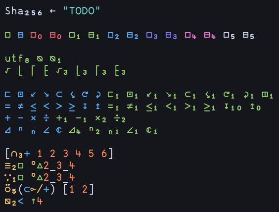

# uiua.vim

Simple plugin containing basic functionalities for writing [Uiua](https://uiua.org) in Vim/Neovim. All features of this plugin were originally part of my personal Neovim configuration, but the links to my configuration on the official Uiua site were a bit confusing, so I moved the functionality here.

This plugin offers:
- Format on save
- Handwritten syntax highlighting mimicking the Uiua pad's colorscheme

<details>
  <summary>Syntax highlighting examples</summary>

  Subscripts with varying function adicity (e.g. dyadic `box`)
  

  Snippet from [uiua-plot](https://github.com/Omnikar/uiua-plot) by Omnikar
  

  Brainfuck interpreter by clarity (member of the Uiua Discord)
  

  Conway's Game of Life
  
</details>

## Setup

### Install

#### [vim-plug](https://github.com/junegunn/vim-plug)
```vim
Plug 'Apeiros-46B/uiua.vim'
```

#### [lazy.nvim](https://github.com/folke/lazy.nvim)
```lua
require('lazy').setup {
  'Apeiros-46B/uiua.vim',
}
```

### Configure

Highlight groups used by the syntax highlighting are listed below. By default, these are set to colors from the Uiua pad (with some slight adjustments). You may want to set these to colors matching your colorscheme of choice.
- `uiuaRed`
- `uiuaOrange`
- `uiuaYellow`
- `uiuaBeige`
- `uiuaGreen`
- `uiuaAqua`
- `uiuaBlue`
- `uiuaIndigo`
- `uiuaPurple`
- `uiuaPink`
- `uiuaComment`
- `uiuaForegroundDark` - This is used when `g:uiua_dark_mode` is true
- `uiuaForegroundLight` - This is used when `g:uiua_dark_mode` is false

You should also customize the following options:
- `g:uiua_format_on_save` - Whether or not to format Uiua files on save (default = true)
- `g:uiua_path` - Path to Uiua executable (default = "uiua")
- `g:uiua_dark_mode` - Whether to use the dark-mode foreground color (default = true)

When changing `g:uiua_dark_mode` (e.g. in a live theme reloading setup), you should call `uiua#ApplyTheme()` after setting the variable.

## Compared to [sputnick1124's plugin](https://github.com/sputnick1124/uiua.vim)

- Their plugin has more functionality (e.g. run and eval commands)
- This plugin has more up-to-date handwritten syntax highlighting covering more features

## Overriding highlighting

The default highlight groups try to mimic the Uiua pad (in terms of what things are highlighted in what color). If you need to modify any of the highlight groups (e.g. I prefer making pervasive functions another color), override the highlight links in an `after/syntax/uiua.vim` file.

<details>
  <summary>Default highlight links</summary>

  ```vim
  hi def link uiuaIdentifier       uiuaForeground
  hi def link uiuaMacro            uiuaForeground
  hi def link uiuaMacroSpecial     uiuaForeground " macro assignments & placeholders
  hi def link uiuaPunctuation      uiuaForeground

  " SF = system function
  " P = pervasive
  hi def link uiuaStack            uiuaForeground
  hi def link uiuaNoadic           uiuaRed
  hi def link uiuaNoadicSF         uiuaRed
  hi def link uiuaMonadic          uiuaGreen
  hi def link uiuaMonadicSF        uiuaGreen
  hi def link uiuaMonadicP         uiuaGreen
  hi def link uiuaDyadic           uiuaBlue
  hi def link uiuaDyadicSF         uiuaBlue
  hi def link uiuaDyadicP          uiuaBlue
  hi def link uiuaTriadic          uiuaIndigo
  hi def link uiuaTriadicSF        uiuaIndigo
  hi def link uiuaOther            uiuaPink " 4 or more arguments
  hi def link uiuaOtherSF          uiuaPink
  hi def link uiuaMonadicMod       uiuaYellow
  hi def link uiuaMonadicModSF     uiuaYellow
  hi def link uiuaOtherMod         uiuaPurple

  hi def link uiuaNum              uiuaOrange
  hi def link uiuaEsc              uiuaAqua
  hi def link uiuaCharSpace        IncSearch " space in character literals
  hi def link uiuaChar             uiuaAqua " character literal
  hi def link uiuaFmt              uiuaAqua " underscore in format strings
  hi def link uiuaStr              uiuaAqua
  hi def link uiuaUnicodeLiteral   uiuaForeground " unicode character entry

  hi def link uiuaSignature        uiuaForeground
  hi def link uiuaModPunct         uiuaForeground " module scopes and ~ in module syntax
  hi def link uiuaModName          uiuaBeige
  hi def link uiuaModMemberName    uiuaForeground
  hi def link uiuaModBind          uiuaBeige " 'Module ~ "file.ua"'
  hi def link uiuaModRef           uiuaBeige " 'Module~Member'
  hi def link uiuaModImportMember  uiuaForeground " ~ Member1 Member2
  hi def link uiuaDebug            uiuaForeground
  hi def link uiuaLabel            uiuaGreen
  hi def link uiuaSemanticComment  uiuaComment " 'Experimental' and 'Track caller'
  hi def link uiuaSignatureComment uiuaComment
  hi def link uiuaComment          uiuaComment
  ```
</details>
