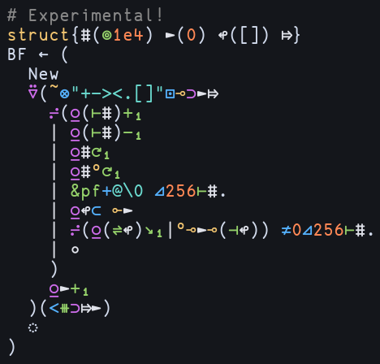

# uiua.vim

Simple plugin containing basic functionalities for writing [Uiua](https://uiua.org) in Vim/Neovim:

- Format on save
- Handwritten syntax highlighting mimicking the Uiua pad's colorscheme

All features of this plugin were originally part of my personal Neovim configuration, but the links to my configuration on the official Uiua site were a bit confusing, so I moved the functionality here.

<details>
  <summary>Syntax highlighting examples</summary>

  Subscripts with varying function adicity (e.g. dyadic `box`)
  

  Snippet from [uiua-plot](https://github.com/Omnikar/uiua-plot) by Omnikar
  

  Brainfuck interpreter by clarity (member of Uiua Discord)
  
</details>

## Installation

### [vim-plug](https://github.com/junegunn/vim-plug)
```vim
Plug 'Apeiros-46B/uiua.vim'
```

### [lazy.nvim](https://github.com/folke/lazy.nvim)
```lua
require('lazy').setup {
  'Apeiros-46B/uiua.vim',
}
```

## Options

- `g:uiua_format_on_save` - Whether or not to format Uiua files on save (default = true)
- `g:uiua_path` - Path to Uiua executable (default = "uiua")

## Compared to [sputnick1124's plugin](https://github.com/sputnick1124/uiua.vim)

- Their plugin has more functionality (e.g. run and eval commands)
- This plugin has more up-to-date handwritten syntax highlighting covering more features

## Highlight groups

The default highlight groups try to mimic the Uiua pad. If you need to modify any of the highlight groups, do so in an `after/syntax/uiua.vim` file.

<details>
  <summary>Default highlight groups</summary>

  ```vim
  hi def link uiuaIdentifier       Normal
  hi def link uiuaMacro            Normal
  hi def link uiuaMacroSpecial     Normal
  
  " SF = system function
  " P = pervasive
  hi def link uiuaStack            Normal
  hi def link uiuaNoadic           Red
  hi def link uiuaNoadicSF         Red
  hi def link uiuaMonadic          Green
  hi def link uiuaMonadicSF        Green
  hi def link uiuaMonadicP         Green
  hi def link uiuaDyadic           Blue
  hi def link uiuaDyadicSF         Blue
  hi def link uiuaDyadicP          Blue
  hi def link uiuaOther            Purple " triadic and above
  hi def link uiuaOtherSF          Purple
  hi def link uiuaMonadicMod       Yellow
  hi def link uiuaMonadicModSF     Yellow
  hi def link uiuaOtherMod         Purple " dyadic and above
  
  hi def link uiuaNum              Orange
  hi def link uiuaEsc              Aqua
  hi def link uiuaCharSpace        IncSearch " space in character literals
  hi def link uiuaChar             Aqua " character literal
  hi def link uiuaFmt              Aqua " underscore in format strings
  hi def link uiuaStr              Aqua
  hi def link uiuaUnicodeLiteral   Normal " unicode character entry
  
  hi def link uiuaSignature        Normal
  hi def link uiuaPunctuation      Normal " assignments, strands, and ;/;;
  hi def link uiuaModPunct         Normal " module scopes and ~ in module syntax
  hi def link uiuaModName          Yellow
  hi def link uiuaModMemberName    Normal
  hi def link uiuaModBind          Yellow " 'Module ~ "file.ua"'
  hi def link uiuaModRef           Yellow " 'Module~Member'
  hi def link uiuaModImportMember  Normal " ~ Member1 Member2
  hi def link uiuaDebug            Normal
  hi def link uiuaLabel            Green
  hi def link uiuaSemanticComment  Comment " 'Experimental' and 'Track caller'
  hi def link uiuaSignatureComment Comment
  hi def link uiuaComment          Comment
  ```
</details>
